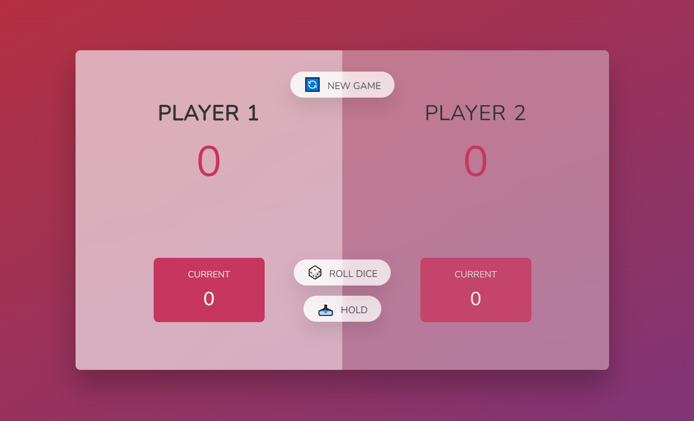

# The Pig Game 🐷

The Pig Game is a fun, two-player game built with HTML, CSS, and vanilla JavaScript. This project is part of Jonas Schmedtmann's JavaScript course on Udemy, and it's a great way to practice manipulating the Document Object Model (DOM) and handling user interactions through event listeners.

## Game Rules 📜

The Pig Game is played in turns by two players. Here are the rules:

1. In their turn, each player can roll a dice as many times as they wish. Each result gets added to their round score.
2. But, if the player rolls a 1, all their round score gets lost, and it's the next player's turn.
3. The player can choose to 'Hold', which means that their round score gets added to their total score. After that, it's the next player's turn.
4. The first player to reach 100 points on the total score wins the game.

## How to Play 🕹️

1. Open `index.html` file in your browser.
2. Decide who goes first. That player clicks the "Roll dice" button.
3. Play according to the game rules above. Enjoy!

## Acknowledgments 🙏

This project is done as a part of Jonas Schmedtmann's [The Complete JavaScript Course 2023: From Zero to Expert!](https://www.udemy.com/course/the-complete-javascript-course/) on Udemy. A huge thanks to Jonas for the great course!
